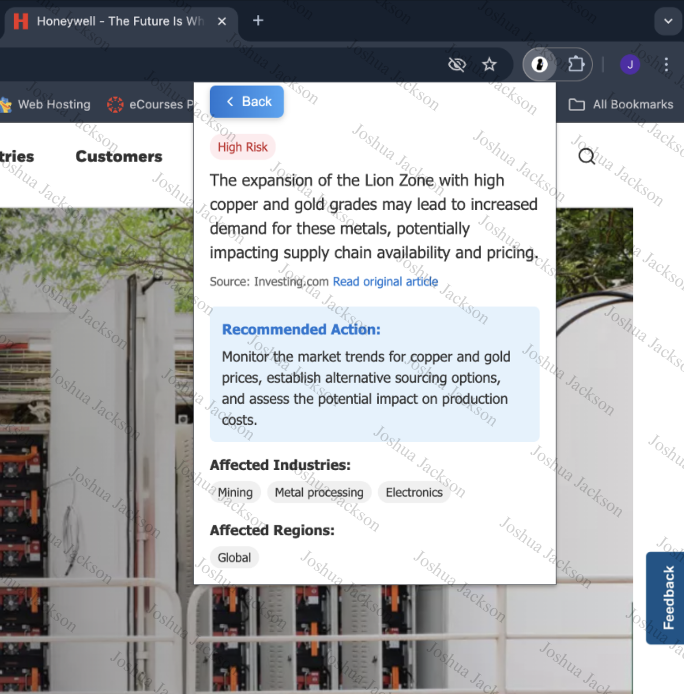
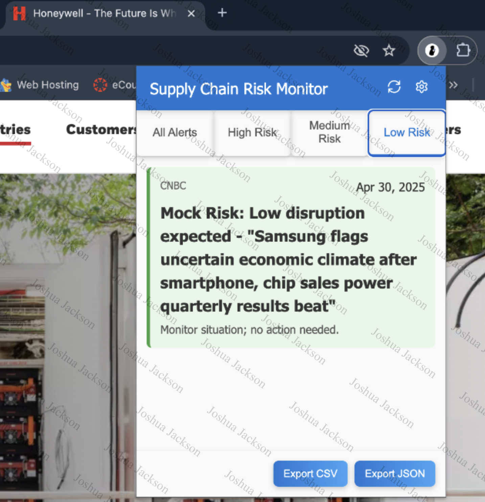

# 🐝 HonChain AI
### "You get more supplies with Honey than with risk."
**HonChain AI** is an AI‑powered Chrome/Edge extension for `Honeywell` that monitors real‑time supply‑chain and financial news, analyzes risk with GPT, and delivers actionable alerts right in your browser.

---

## 📁 Project Structure
```
HonChain_AI/
├── extension/
│    ├── assets/
│    │   ├── icon128.png
│    │   ├── icon16.png
│    │   └── icon48.png
│    ├── background.js
│    ├── content-scripts/
│    │   └── alert-overlay.js
│    ├── manifest.json
│    └── popup/
│        ├── popup.css
│        ├── popup.html
│        └── popup.js
├──server/
│  ├── api/
│  │   ├── alerts.js
│  │   ├── analytics.js
│  │   └── settings.js
│  ├── config/
│  │   └── openai.js
│  ├── .env
│  ├── models/
│  │   └── alert-schema.js
│  ├── server.js
│  ├── services/
│  │   ├── news-aggregator.js
│  │   ├── notification-service.js
│  │   └── risk-analyzer.js
│  └── utils/
│      └── index.js             
└──README.md
```
---

## 🚀 Features
### 1. Real‑time News Collection 
- Polls and scrapes RSS feeds (WSJ, Investing.com, etc.)
- Normalizes and filters by industry (Electronic Components, Aerospace, Chemicals & Materials, Industrial Equipment, Software/IT)

### 2. AI‑Driven Risk Analysis
- Sends headlines to GPT‑4 via OpenAI API
- Returns severity‐coded insights (Green/Yellow/Red)

### 3. Browser UI
- Custom overlay & popup with animated badges, blur/shadow effects
- Unread‐alert badge on toolbar icon
- Settings panel for industry filters

### 4. Persistent Storage
- Alerts stored in chrome.storage for history & across popup opens

### 5. Export & Reporting
- Download alert history as CSV or JSON
---

## 📦 Tech Stack
```
HTML · CSS · JavaScript · Chrome Extension API · Node.js · Express.js · OpenAI API · RSS Feeds · chrome.storage
```
---
## 🛠️ Prerequisites

- **Node.js** v14 or higher
  - Check Node.js version:
```bash
node --version
```
  - Install: https://nodejs.org/
- **npm** (usually comes with Node.js)
- A modern **Chromium‑based browser** (Chrome or Edge) for the extension
- **OpenAI API key** (set in `server/config/openai.js` or via `process.env.OPENAI_API_KEY`)


---
## ⚙️ Installation
_Assumes Node.js (>=14) and npm are installed._
### 1. Clone the repo
```bash
git clone https://github.com/
```
```bash
cd HonChain_AI
```
### 2. Set up the server
```bash
cd server
```

```bash
npm init -y
```

```bash
npm install express cors axios rss-parser dotenv openai # installs Express, OpenAI, and other dependencies
```

### 3. Configure environment variables
- Create `.env` file inside the directory `server/`
- Inside `.env` file, set two required variables: 
```
PORT=3000
```
```
OPENAI_API_KEY="your_openai_api_key_here"
```
### 4. Start the backend (in Terminal #1)
```bash
cd server
```

```bash
node server.js
```

- You should see a message confirming that the server is `running on port 3000`.
- To exit server: Press `"control + C" (i.e. ⌃C)`

### 5. Ensure the backend is accessible
- Open your browser, visit:
```
http://localhost:3000/health
```
  - You should see: `{ "status": "ok", "message": "Server is running" }`
  - If this works, your backend is definitely accessible.

### 6. Check the alerts endpoint
**a**. Visit this URL in your browser: 
```
http://localhost:3000/api/alerts
```
   - Initially, you may get an empty list `([])` if no news has been processed yet. 

**b**. Trigger news fetch manually by entering the following `curl invocation` in its own, terminal. `(i.e. terminal #2)`
```bash 
curl -X POST http://localhost:3000/api/alerts/refresh
```

- The `curl invocation` is to send an HTTP POST request to the local backend’s `refresh alerts` endpoint.
- Use the `curl invocation` to test or manually trigger an alerts refresh without going through the browser UI.

**c**. After a few seconds, check again: 
```
http://localhost:3000/api/alerts
```
   - You should see `JSON-formatted alert data` returned from GPT.
   - You should also see `JSON-formatted data` returned in `terminal #2`.
   - You should also see an output such as:

      `Server running on port 3000`
      
      `Fetching latest news from all sources...`
      
      `Processing 20 news items...`
      
      `Generated 13 risk alerts`

### 7. Load the extension
#### Open Chrome/Edge → Extensions → Load unpacked
**a**. Open Chrome and navigate to: 
```
chrome://extensions/
```

**b**. Enable `"Developer mode"` in the top-right corner

**c**. Click `"Load unpacked"` and select your extension directory
   - (i.e. select `Load unpacked` > select `extension` folder in `HonChain` > click `Select`)

**d**. The extension should now appear in your browser toolbar
   - To create shortcut:
     - select `puzzle piece` icon
     - select `Manage Extensions`
     - select `Keyboard Shortcuts` in the left pane
     - select `pencil` icon to choose shortcut keys
     - press keys you prefer to use for the shortcut

**e**. If you need to update the extension during development, click the `refresh icon` on the extension card in the `Extensions` page.

---

## 🧠 Interaction Between Components

#### The server fetches news articles from RSS feeds, analyzes them using OpenAI's API to identify supply chain risks, and provides endpoints for the extension to retrieve these alerts. The Chrome extension connects to your local server, registers itself, and periodically polls for new alerts. It displays notifications for new risk alerts and lets you view detailed information about each alert. The server runs on 
```
http://localhost:3000
```
#### by default, which matches the API base URL configured in your extension. Make sure nothing else is running on that port.
---

## 📖 Usage
**1.** Click the HonChainAI icon in your toolbar.

**2.** Open Settings to toggle industries.

**3.** Monitor incoming alerts and badge counts in real time.

**4.** Click any alert to view detailed AI‐generated insight.

**5.** Export alert history via the Download button.

---

## 🔧 Configuration
| Key                 | Description                         | Default                   |
|---------------------|-------------------------------------|---------------------------|
| `PORT`              | Backend server port                 | `3000`                    |
| `OPENAI_API_KEY`    | Your OpenAI API credential          | _required_                |
| `RSS_FEEDS`         | Comma‑separated RSS feed endpoints  | configured in `openai.js` |
| `STORAGE_NAMESPACE` | Namespace for `chrome.storage` keys | `honchain_ai`             |

---

## 📸 Screenshots
### 1. Start Server (Terminal #1)


### 2. Refresh curl Command (Terminal #2)


### 3. Output After curl Command To Refresh (Terminal #1)**


### 4. HonChain AI Supply-Chain Browser Extension





---

## 👤 Project By
**Team JAMS**  
Joshua Jackson - Lead AI & FullStack Developer  
Anthony Pham - Developer  
Marc Mata - Developer  
Sukhraj Singh - Developer  

Honeywell AI Launchpad Hackathon · Prairie View A&M University · May 2025
